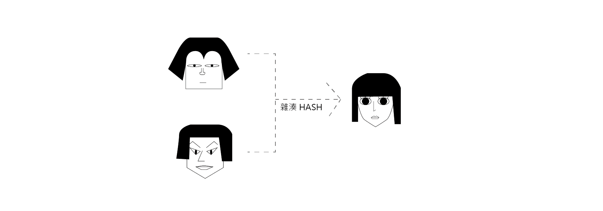

## 請說明雜湊跟加密的差別在哪裡，為什麼密碼要雜湊過後才存入資料庫

* 加密（Encryption）：

  加密主要是以金鑰（key）作為加密與解密的方法，通常為一對一的形式。可分為 AES（Advanced Encryption Standard）對稱加密演算法和 RSA 非對稱加密演算法。  
  * AES：加密與解密的金鑰都是一樣的。透過彼此說好的金鑰可以打開被金鑰加密的檔案，但當今天金鑰被有心人士拿走，則會造成檔案洩漏。
  * RSA：分為公鑰（Public key）和私鑰（Private key）。先以公鑰加密後，以私鑰解密。相較於 AES，加密的效果較好，因為私鑰從頭到尾都拿在自己的手中，即使被拿走公鑰，還是難以打開檔案。
 
* 雜湊（Hash）：

  與加密不同，通常為多對一的形式，一組明碼經過演算法加密後可能產生同一組暗碼，造成難以以雜湊後的暗碼去回推原來的密碼。加密則可透過拿到金鑰去反推加密前的密碼。  
  但如果利用暴力破解法，去解析明碼與雜後的關係，還是有可能破解雜湊。此時便會需要利用加鹽（salting）自動幫忙產生亂數，雜湊的密碼就會是從單純的密碼，變成要雜湊「密碼+亂碼」，以提高密碼的安全性。

資料庫不能直接存明碼，而是先雜湊過再存是為了防止當資料庫被入侵時，使用者的資料全被盜光。密碼被雜湊過，因為無法回溯的特性，即使資料庫被入侵，損害相比之下較小。


雜湊後的網美臉，不可回溯。（我真無聊）


## `include`、`require`、`include_once`、`require_once` 的差別

* `include`：
  
  引入其他檔案，並可自引入之後引用其變數。

  〈[php manual include](https://www.php.net/manual/en/function.include.php)〉提供的範例：
  ```
  vars.php  // 要被引入的檔案
    <?php

    $color = 'green';
    $fruit = 'apple';

    ?>

  test.php // 主檔案
    <?php
    // 因為此時還沒有引入 vars.php，所以變數沒有值
    echo "A $color $fruit"; // A

    include 'vars.php';
    // 引入了 vars.php，也引入了 vars.php 裡的變數與值
    echo "A $color $fruit"; // A green apple

    ?>
  ```
  當引入的位置是在 function 中，則被引入的變數只會存在於該 function 的作用域裡。
同樣引用〈[php manual include](https://www.php.net/manual/en/function.include.php)〉提供的範例：

  ```
  <?php

    function foo() {
      global $color;
      // 在 function 裡引入檔案
      include 'vars.php';
      echo "A $color $fruit";
    }

    /* vars.php is in the scope of foo() so     *
    * $fruit is NOT available outside of this  *
    * scope.  $color is because we declared it *
    * as global.                               */

    foo();                    // A green apple
    echo "A $color $fruit";   // A green

  ?>
  ```
  當檔案被引入時，會預設為 HTML 的格式，所以如果希望是以 PHP 呈現，則需要以 `<?php ?>` 包覆。

* `require`：
  
  `require` 與 `include` 最大不同之處為當使用 `require` 出現錯誤時（例如找不到檔案），會顯示錯誤（E_COMPILE_ERROR），並會停止程式碼。而 `include` 雖然會跳出警告（E_WARNING），但程式碼還是會繼續執行。
* `include_once`：

  人如其名，與 `include` 的差別為，不會重複引入。可以避免函式混淆或是重複宣告變數等問題。

* `require_once`：

  與 `require` 功能相似，除了會檢查檔案是否已經被引入，以避免重複引入。

參考：
1. [include](https://www.php.net/manual/en/function.include.php)
2. [require](https://www.php.net/manual/en/function.require.php)
3. [include_once](https://www.php.net/manual/en/function.include-once.php)
4. [require_once](https://www.php.net/manual/en/function.require-once.php)

## 請說明 SQL Injection 的攻擊原理以及防範方法

利用 SQL 語法中以字串拼接的漏洞，填入惡意的輸入值以竊取資料。
假設今天想透過輸入 username 從 users table 拿資料，一般預期使用者會輸入 username：

```
// ann 查 ann 就輸入 ann
"SELECT * FROM users WHERE username = 'ann'"
```

但當今天有人想要直接拿取所有使用者資料，而將輸入的值改為 `ann' OR 1`：

```
"SELECT * FROM users WHERE username = 'ann' OR 1"
```
因為 `1` 永遠是 `true`，所以就可以直接拿取整筆 users 裡的名單。

為防止 `SQL Injection` 的行為，可以利用 `prepared statement`，將原來直接用字串輸入的地方，改用參數傳入。
在 PHP 裡有內建的方法可以用：
```
$stmt = $conn->prepare("SELECT * FROM users WHERE username = ?"); // ? 為需傳入參數的地方
$stmt->bind_param("s", $username); // 將參數傳入。字串用 s，數字用 i（假設前面已經有宣告 $username）
$result = $stmt->execute(); // 執行
``` 

##  請說明 XSS 的攻擊原理以及防範方法

在別人的網站執行 script。
Client 端填寫的資料非純文字，會被瀏覽器解釋為程式碼或非純文字的形式。
例如留言板內容為 `<h1>HAHAHA</h1>`，則留言顯示會是 `HTML h1` 格式的字體大小。若今天寫的內容為 `<script>alert(location.href("https://fishing.com"))</script>`，則就可以讓造訪的使用者被導到釣魚網站，或是導到一個看起來介面完全一模一樣的介面。當使用者使用假的頁面登入真的帳號密碼，使用者的資料就被竊走了。

PHP 內建可用 `htmlspecialchars` 將輸入都變成文字，所以即使是輸入 `<script>alert(location.href("https://fishing.com"))</script>`，也不會跳到其他網頁。建議是在顯示資料的時候使用。

在 JavaScript 中也可利用以下 function 去跳開 XSS 攻擊：

```
function escapeHtml(unsafe) {
  return unsafe
  .replace(/&/g, '&amp;')
  .replace(/</g, '&lt;')
  .replace(/>/g, '&gt;')
  .replace(/"/g, '&quot;')
  .replace(/'/g, '&#039;');
}
```


## 請說明 CSRF 的攻擊原理以及防範方法

全名為 Cross-site Request Forgery Attacks，跨網站偽造要求的攻擊。

在不同的網域底下，可以假裝是使用者本人去其他使用者有登入的網域發送 request。
* GET：  
  可以利用 `a` 標籤、`img` 標籤將值帶到目標網域中。
* POST：  
  可以利用 `form` 標籤將值帶入到目標網域中，去拿取或修改資料。

但如果目標網域 `API` 的 `Access-Control-Allow-Origin` 設成 `*`，接受跨網域的請求的話，則不論是什麼 `method` 或是資料形式都無法擋住 `CSRF` 的攻擊。

* 使用者的防範方法：
  * 使用完網頁就登出，這樣不管從哪個網域偽造發送請求都需要登入才可以操作。
  * 但這樣很不方便，尤其是現在一個使用者可能擁有很多網站的會員，每次都要重新輸入密碼，一個不小心還要使用忘記密碼大法。防了駭客，也防了自己。
* Server 的防範方法：
  <!-- * 任意 domain 或 同一 domain -->
  * 請求的 `header` 的 `referer` 代表請求的來源。可以透過檢視 `referer` 所帶的 domain 來防止非法 domain 的攻擊。
    1. 瀏覽器不一定會帶 `referer`。
    2. 使用者可以關閉 `referer` 功能。
    3. `server` 可能會擋掉由真的使用者發出的請求。
  * 加上圖形或簡訊驗證碼，只有使用者知道驗證碼是什麼，所以可以有效防止攻擊者竊取資料。
  * 加上 `CSRF token`：
    * 圖形或簡訊驗證碼就是因為驗證碼是利用只有使用者自己知道的特性所以可以有效防範，利用此特性在 `form` 裡加上 `input type="hidden"` 的欄位，裡面的值為隨機生成 `crsftoken`，並將隨機生成的值存在 `server` 的 `session` 中。只要請求表單裡的 `token` 和存取在 `server` 中的 `token` 是一樣的，則可以代表是使用者本人。
    * 如果 `Access-Control-Allow-Origin` 為 `*`，且 `server` 接受攻擊者的 `domain` 的請求，則攻擊者可以透過 `request` 拿取 `csrftoken`。
  * Double Submit Cookie：
    同樣由 `server` 隨機產生 `csrftoken` 的值，並讓 `client` 端設置 `cookie`。因為是在目標網域下所設置的 `cookie token`，所以儘管有表單裡的 `csrftoken`，但由於是從其他網域所發送的請求，所以 `cookie` 中並無 `csrftoken`，於是請求就會被擋掉了。
  * 瀏覽器的防範方式：
    * Chrome 利用 `SameSite cookie` 在 `Set-Cookie` 的 `header` 裡加入 `SameSite` 即可。`SameSite` 有 `Lax`、`Strict`、`None`的模式，主要是用來阻止瀏覽器將 Cookies 跨網站發送。
      * `Strict`：顧名思義，要求最嚴格。完全禁止第三方的 Cookies。適用於銀行等需交易的網站。
      * `Lax`：`a`、`link rel="prerender"`、`form method="GET"` 會帶 cookie，但 `method="POST"` 或其他方法就不會帶上 cookie。
      * `None`：所有網站都可以存取 cookie，但 Secure Attribute 一定要設成 True。 


參考：
1. [什麼!? SameSite Cookies Policy 更新了— Chrome SameSite Attribute 簡介](https://medium.com/it-digital-%E4%BA%92%E8%81%AF%E7%B6%B2/%E4%BB%80%E9%BA%BC-samesite-cookies-policy-%E6%9B%B4%E6%96%B0%E4%BA%86-2b317e6cf6bb)
2. [讓我們來談談 CSRF](https://blog.techbridge.cc/2017/02/25/csrf-introduction/)