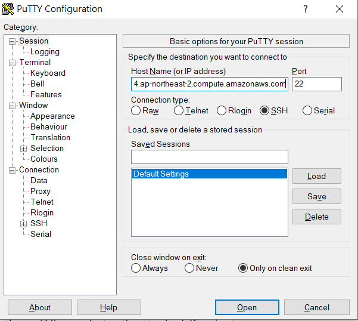
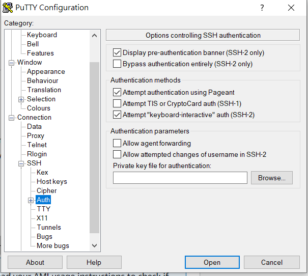
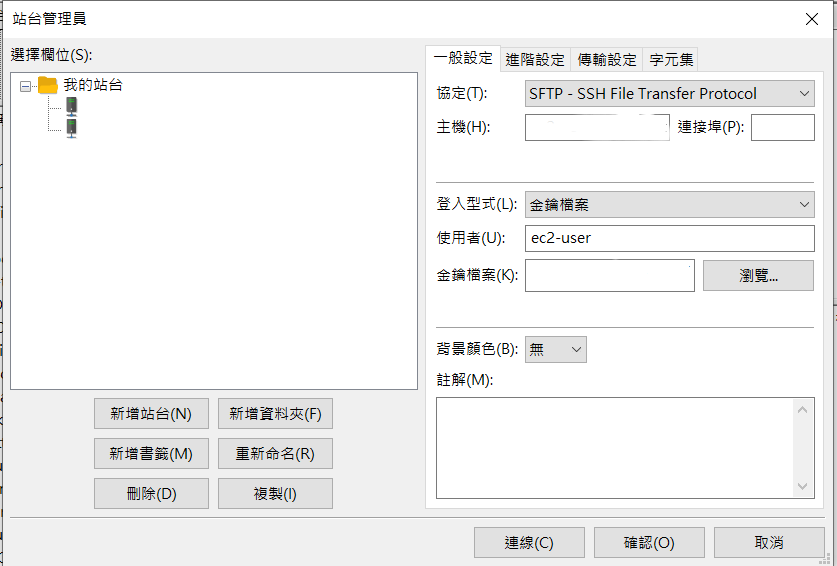
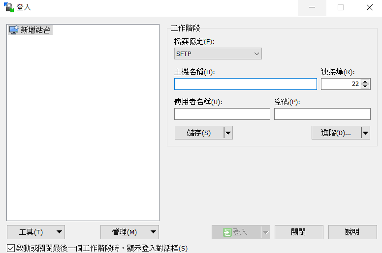
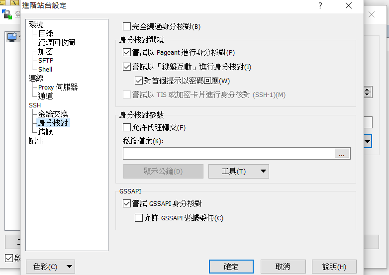

辦 aws 帳號，[這裡](https://tinyurl.com/y56wofxm)去。註冊完後就可以開始建立 `EC2`。

## 建立 EC2

1. 選擇好區域後可以 Launch instances：
   
2. 隨便選了第一個（雖然後知後覺看大家都選 Utunbu），但我已亂選XD：
   
3. 第二步選免費的即可：
   
4. 之後就一步一步隨意填，第六步：Congifutre Security Group 主要是在 `EC2` 啟動後，哪些 IP：設定 `aws` 的 `Elastic IPs`  和 PORT 可以連。預設會有 `SSH`，其他的這邊先不設定也沒關係，建立好 instance 後，還可以進 instance 設定。
   
5. 全部設定完成後，會需要設定金鑰，記得要將金鑰存取至適當的位置，之後連線、傳送檔案會需要。

## 連線 EC2

1. 連線 EC2 instance 需要有其 IP、帳號以及金鑰。點擊指定 instance，按右上角的 `Action > Connect` 就可以查看相關資訊。（ec2 會有預設的帳號，在此例為 `ec2-user`）
2. Windows 前置作業：將金鑰 `.pem` 檔利用 `PuttyGen` 改成 `.ppk`。相關教學參考：〈[[ AWS ] 將 AWS EC2 的 .pem 檔轉換為 .ppk 檔教學](https://oranwind.org/-aws-jiang-aws-ec2-de-pem-dang-zhuan-huan-wei-ppk-dang-jiao-xue/)〉。 
3. 因為 ssh 沒成功，所以改使用 PuTTY 連。輸入 `帳號@Public IPv4 DNS`，再至 `Connection > SSH > Auth` 選取金鑰檔案後，按 `Open` 即可連線到對應的 instance。  
   
   
4. 要注意 `inbound rules` 的  IP：設定 `aws` 的 `Elastic IPs` ` 和 `PORT` 的設定，否則會無法連線。可從 `instances` 下方 `Security > Security Groups > Edit inbound rules` 調整設定。

參考：
1. [（二）EC2（Elastic Compute Cloud）－－AWS經驗教學](https://tinyurl.com/y6p7c3ro)
2. PuTTY 官方相關說明：〈[使用 PuTTY 從 Windows 連線至您的 Linux 執行個體](https://docs.aws.amazon.com/zh_tw/AWSEC2/latest/UserGuide/putty.html)〉

## 設定 EC2 環境

**安裝及啟動 LAMP Web 伺服器**
註：`LAMP` 各字母分別為 `Linux`、`Apache`、`MySQL`、`PHP`。  

1. 連線到 `instance`。
2. 確保所有軟體套件為最新版本：`sudo yum update -y`
3. 安裝相關軟體套件與依存項目：`sudo yum install -y httpd24 php72 mysql57-server php72-mysqlnd`
4. 啟動 Apache Web 伺服器：`sudo service httpd start`
5. 設定 Apache Web 伺服器在每次系統開機時啟動：`sudo chkconfig httpd on`
6. 確認是否已啟用：`chkconfig --list httpd`
7. 測試：在瀏覽器輸入 `Public IPv4 address` 或 `Public IPv4 DNS`，如果有看到 Apache 測試頁（在 /var/www/html 下沒有檔案的前提下），即是成功。

**設定檔案許可**  
如果要可以操作 `/var/www/html` 中的檔案，需修改目錄的所有權和許可。
1. 將使用者新增至 `Apache` 群組：`sudo usermod -a -G apache ec2-user`
2. 重新登入，以取得新群組並驗證資格：
   `exit`  
   `groups`
3. 將 `/var/www` 的群組所有權及內容變更為 `Apache` 群組：`sudo chown -R ec2-user:apache /var/www`
4. 若要新增群組寫入許可並在將來的子目錄上設定群組 ID，請變更 /var/www 及其子目錄的目錄許可：
   `sudo chmod 2775 /var/www`
   `find /var/www -type d -exec sudo chmod 2775 {} \;`
5. 若要新增群組寫入許可，請以遞迴方式變更 /var/www 及其子目錄的檔案許可：`find /var/www -type f -exec sudo chmod 0664 {} \;`

**保護資料庫伺服器**
1. 啟動 MySQL 伺服器：`sudo service mysqld start`
2. 執行 mysql_secure_installation：`sudo mysql_secure_installation`
   * 輸入根帳戶密碼，預設根帳戶沒有設定密碼，按 Enter 跳過。
   * 輸入 Y 設定密碼：輸入兩次安全密碼。
   * 之後都按 Y
3. 如希望 MySQL 伺服器在每次系統開機時啟動：`sudo chkconfig mysqld on`

**安裝 phpMyAdmin**
1. 連到 instance
2. 安裝所需項目：`sudo yum install php72-mbstring.x86_64 -y`
3. 重啟 `Apache`：`sudo service httpd restart`
4. 到 `Apache` 根目錄：`cd /var/www/html`
5. 直接將檔案下載到 `instance`：`wget https://www.phpmyadmin.net/downloads/phpMyAdmin-latest-all-languages.tar.gz`
6. 建立 phpMyAdmin 資料夾，並解壓縮到同個資料夾：`mkdir phpMyAdmin && tar -xvzf phpMyAdmin-latest-all-languages.tar.gz -C phpMyAdmin --strip-components 1`
7. 刪除壓縮檔：`rm phpMyAdmin-latest-all-languages.tar.gz`
8. 測試：如果在 `http://my.public.dns.amazonaws.com/phpMyAdmin` 有 `phpMyAdmin` 的登入頁面即為成功。
9. 利用使用者名稱：`root` 及之前設定的 `MySQL` 根密碼登入 `phpMyAdmin`。

參考：
1. 以上內容多擷取自〈[教學：使用 Amazon Linux AMI 安裝 LAMP Web 伺服器](https://docs.aws.amazon.com/zh_tw/AWSEC2/latest/UserGuide/install-LAMP.html)〉

## 從本機端上傳檔案

**使用 `FileZilla`：**
1. 新增站台
2. 協定選擇 `SFTP`
3. 主機輸入 `Public IPv4 DNS`  
4. 登入型式選擇金鑰檔案，並選擇之前設定的金鑰檔案，即可連線。  
   

**使用 `WinSCP`：**

1. 下載 WinSCP
2. 主機、使用者名稱同 `FileZilla` 的設定
3. 按進階，於左側欄位中選擇身分核對，選擇金鑰檔案，即可連線。  
   
   
4. 要注意網頁檔案要傳到 `/var/www/html` 下，預設會在使用者名稱資料夾下。

參考：
1. 〈[[ AWS ] Windows 傳送檔案到 AWS EC2 教學](https://oranwind.org/-aws-windows-chuan-song-dang-an-dao-aws-ec2-jiao-xue/)〉

## 設定網域

使用 [gandi](https://www.gandi.net/zh-Hant) 網域。

1. 固定 IP： 分配一個 `aws` 的 `Elastic IPs`，並 `associate` 到指定的 `instance`，如此一來重啟 `instance`，IP 也不會變動。 
2. 申請好網域後，至網域的區域檔紀錄將網域與 `aws` 的 `Public IPv4 address` 連上。
3. A 類型，TTL（time to live） 用預設的就可以了，有關 TTL 的相關說明可參考：〈[TTL 是什麼？該設定多久？](https://haway.30cm.gg/what-is-ttl/)〉

參考：
1. [Linking Your Domain to Your Website](https://docs.gandi.net/zh-hant/domain_names/common_operations/link_domain_to_website.html)
2. [A 紀錄](https://docs.gandi.net/zh-hant/domain_names/faq/record_types/a_record.html)
3. [CNAME 紀錄](https://docs.gandi.net/zh-hant/domain_names/faq/record_types/cname_record.html)

## 其他

1. 不小心把 TTL 設定得太長，重新設定至新的 IP 時，要把 `DNS Cache` 刪掉，網域才可以順利連到新的 IP 上，不然會卡在舊的 IP。
2. 主網域預設的頁面就是檔案夾下的 index.XXX 的頁面。