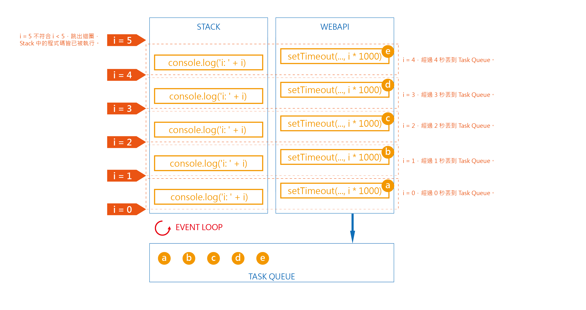
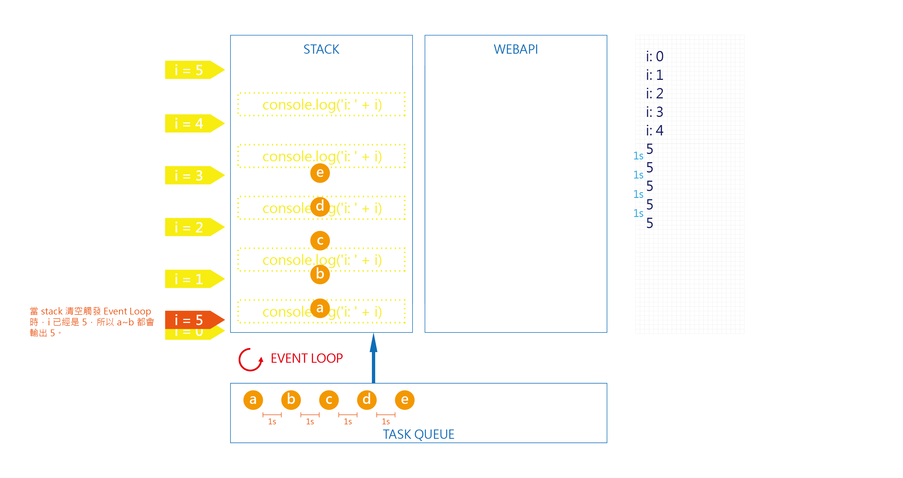

## Event Loop + Scope
>　請說明以下程式碼會輸出什麼，以及盡可能詳細地解釋原因。
```
for(var i=0; i<5; i++) {
  console.log('i: ' + i)
  setTimeout(() => {
    console.log(i)
  }, i * 1000)
}
```

---

以上程式碼可視為變數 `i` 和 `for loop` 在同一個 `scope`：

```
var i
for(i=0; i<5; i++) {
  console.log('i: ' + i)
  setTimeout(() => {
    console.log(i)
  }, i * 1000)
}
```

`console.log('i: ' + i)` 的部分會依 `i = 0 ~ 4` 迴圈順序輸出。  
而 `setTimeout(() => {console.log(i)}, i * 1000)` 會在每次迴圈執行的時候丟到 webapi 的區域先放著，並瀏覽器會設定 `i * 1000` 的間格再進到 queue 排隊。等 `console.log('i: ' + i)` 都執行完（stack 清空）後，`console.log(i)` 便會透過 Event Loop 進到 Stack 去執行。只是此時已經是跑完 `for loop` 的狀態，`i` 的值是 `5`，所以後續輸出的都是 `5`。

```
0
1
2
3
4
5
// 隔 1s
5
// 隔 1s
5
// 隔 1s
5
// 隔 1s
5
```


