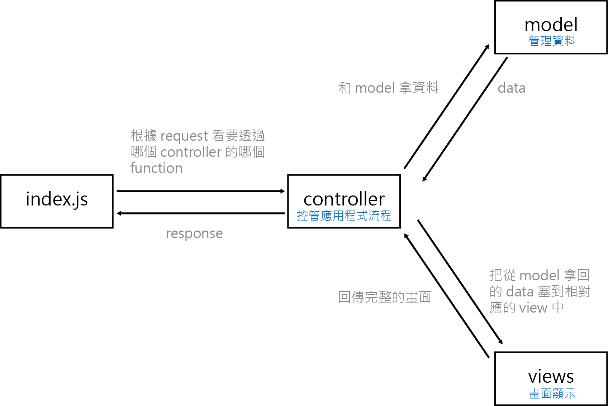

## 什麼是 MVC？

MVC 是一種將網頁（應用程式）的架構劃分為 Model、View、Controller 三個部分的軟體架構模式，讓整體更有系統性，以利分工與後續維護。

## 什麼是 ORM？

* Controller：  
  負責根據所接收的 request 處理並回傳 response。依據不同面向，一個專案可能也會有多個 controller，像是會員系統和商品管理可交由不同的 controller 去控制。
* Model：  
  負責資料處理、存取資料庫，並回傳相對應的資料。
* View：  
  負責畫面顯示。

## 請寫下這週部署的心得

本來想部署在自己的主機上的，但是過了 nginx 的關卡後卻一直卡在設定資料庫，所以就還是先用 heroku 部署，真的是飛速咻咻咻的完成了。
  

以下記錄一下在用 nginx 時遇到的錯誤：
* listen on 80 port 時出錯：
  `Error: listen EADDRINUSE: address already inuse :::80`  
  參考解法：[Nginx will not start (Address already in use)](https://stackoverflow.com/questions/42303401/nginx-will-not-start-address-already-in-use) 
  1. 看 Active Internet connections 中 80 port 是否被占用：  
      `sudo netstat -tulpn`
  2. 刪除正在使用的 port 並重啟 nginx：  
      `sudo fuser -k 80/tcp`（無法用上文中的 `sudo kill -2 <PID>`，就改用此指令了）   
      `sudo service nginx restart`
  3. 如果畫面是 welcome to nginx 就代表成功了

* 預設看起來沒有 sites-availabel/ sites-enabled folder：
  1. create /etc/nginx/sites-available /etc/nginx/sites-enabled
  2. edit /etc/nginx/nginx.conf 的 http block，加入：  
    `include /etc/nginx/sites-enabled/*`
  3. sites-available 的 default 可複製：〈[Default Nginx Sites-Available Configuration File Contents](https://coderrocketfuel.com/article/default-nginx-configuration-file-inside-sites-available-default)〉

補充 18 週部署完的心得：  
因為第 14 週部署的時候直接盲選 Amazon linus 2，也沒有特別設定從其他地方連資料庫。裝了 nginx 之後連不到 phpmyadmin，找了資料大部分都是 utunbu 的，所以後來直接重新 lauch 新的 instance 並且跟著檢討影片設定任意主機，讓 mySQL workbench 也可以連後才部署成功，也順道複習了部署。另外，有設定好 migration，就可以直接在遠端主機跑 `db:migrate` 設定好資料庫，我覺得很方便。  
粗略的步驟記在〈[
砍掉重練 ec2 和 nginx 部署](https://anpan.coderbridge.io/2020/10/27/ubuntu-nginx-deploy/)〉。

## 寫 Node.js 的後端跟之前寫 PHP 差滿多的，有什麼心得嗎？

覺得最有感的是不用再翻找各個檔案看我在哪個頁面的時候究竟做了什麼XD 從 index.js 和 controller 去看就可以知道在什麼 request 做了什麼處理，再去看各個 function 做了什麼。  
在用 PHP 寫的時候，不同 request 就要去不同的 php 檔案處理。即使有一樣的功能（例如身分驗證），就要每個地方去處理，即使是 `require_once` 也要去各個檔案確認看有沒有引入，有時候會變得很混亂。但這周透過 middelware，在 index.js 的入口頁面就可以一併處理，整體邏輯會比較清晰，而對於後續要移除或是加入共同功能也比較方便。而利用 sequelize，不用再一直寫 SQL query，SQL Injection 也直接處理好了，就省去了很多要自己一一處理的事情。
>>>>>>> dbb1892d37534ee87964c4a7e6775c719db2e19e
