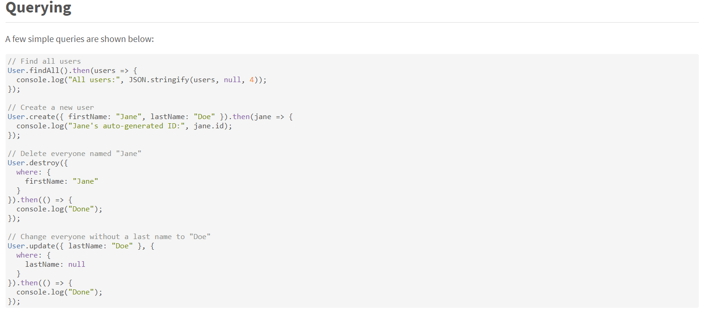
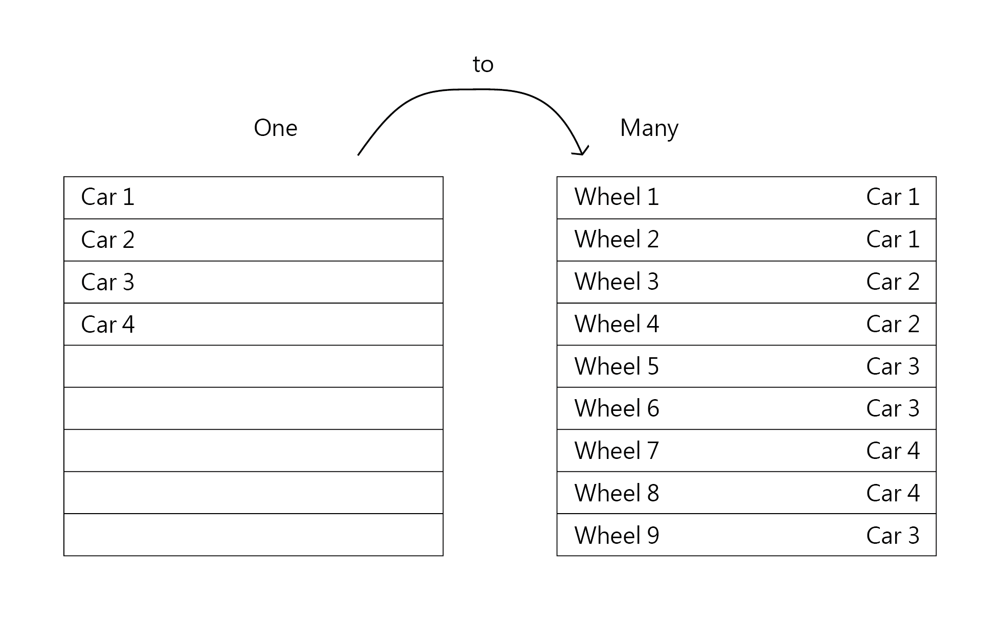

## 1. 什麼是反向代理（Reverse proxy）？

在一般 Client 端和 Server 端的溝通中，Client 端和 Server 互相知道對方是誰。藉此 Server 端可以阻擋來自特定區域的 request 等等。  
而 Client 端則可以透過 Proxy Server（代理伺服器）變造身分，讓 Server 以為 request 是從不同的區域來的。或是來自不同 Client 的請求都被視為是同一個人所發送的。此時 Server 端便將 Proxy Server 視為 Client。


而 Reverse proxy 和上述的 Proxy Server 相反，是由 Server 端使用 Proxy Server 讓 Client 以為自己是發請求到 A 網站，其實則是發給不同的網站。


而使用 Reverse Proxy Server 的其中一個原因是因為只有一個 Service 可以佔領 80 port，當今天一個域名 aaa.com 對應到 80 port，而 b.aaa.com 想要對應到其他的 port 去跑其他的網站時，就需要 Reverse Proxy Server，讓不同的網域去對應到不同的 port，Reverse Proxy Server 看到 b.aaa.com 就知道要把使用者導到 Service 1。

參考：
1. [6 common use cases of Reverse Proxy scenarios](https://hub.packtpub.com/6-common-use-cases-of-reverse-proxy-scenarios/)（其他使用情景可參考）

-----

## 2. 什麼是 ORM？

ORM，全名為 Object-reational mapping，主要是透過程式語言（JavaScript 或其他）去做 SQL 存取資料庫。  
在過去要從資料庫存取資料時，要自己寫 SQL，還要處理 `SQL Injection`，像是：

```
$sql = "UPDATE `db_table` SET is_deleted = 1 WHERE id = ? AND username = ?";
$stmt = $conn->prepare($sql);
$stmt->bind_param("is", $id, $_SESSION['username']);
$result = $stmt->execute();
```

而透過 ORM 可以幫忙處理 `SQL Injection`，也可以使程式碼更簡潔有組織：


截圖自：[Sequelize Getting started](https://sequelize.org/v5/manual/getting-started.html)

-----

## 3. 什麼是 N+1 problem？

有兩個 db table：Car 和 Wheel，當今天如果想要列舉每個車的有什麼輪子，就必須先跑過 Car table，再以 CarID 去找相對應的輪子。得到最後的資料，就需要跑 N+1 次，在資料量還少的時候可能會沒什麼感覺，但當資料量變多的時候（可能有 5000 部車的資料），就變成要搜尋 5000+1 次，發送 5000+1 次的 query，可能就會拖垮資料庫的效能。

```
SELECT * FROM Car; // 1
SELECT * FROM Wheel WHERE CarID = ?; // Car table 裡有多少 rows 就要跑幾次（N）
```



**解決方法：**  
事先就要告訴 ORM 搜尋條件，讓 ORM 可以事先就取得條件資料（通常稱作 eager loading）。在 Sequelize 裡基本上可以用 include 去取得（詳 〈[Sequelize Eager Loading](https://sequelize.org/master/manual/eager-loading.html)〉）。

```
Car.hasMany(Wheel)
Wheel.belongsTo(Car)
Car.findAll({ include: Wheel })
```

參考
1. [What is the “N+1 selects problem” in ORM (Object-Relational Mapping)?
](https://stackoverflow.com/questions/97197/what-is-the-n1-selects-problem-in-orm-object-relational-mapping)
2. [SOLVING THE N+1 PROBLEM IN ORMS](https://thecodingmachine.io/solving-n-plus-1-problem-in-orms)
3. [Sequelize Eager Loading](https://sequelize.org/master/manual/eager-loading.html)

