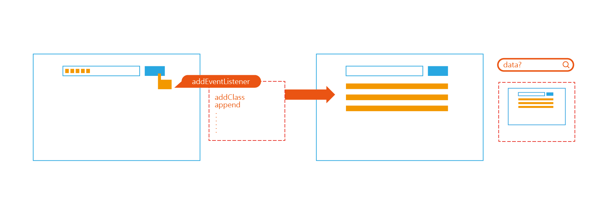
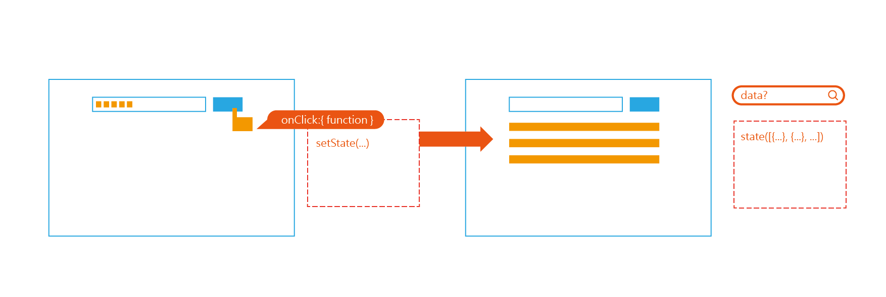

## 為什麼我們需要 React？可以不用嗎？

當 `HTML` 渲染頁面時，會重新渲染整個 `DOM`，但當利用 `JSX`（JavaScript eXtension 的縮寫），`React` 會產生 `Virtual DOM`（可看作是網頁 `DOM` 的副本），而透過 `Virtual DOM`，`React` 可以判斷 `DOM` 真正需要改變的是哪些部分，並只重新渲染有改變的部分。另外 `React` 也可以將網頁畫面依功能區分成各個 `Component`，除了利於重複使用，自定義的 `Component` 名稱（自定義的 `Component` 需為大寫開頭以利於與 `html` 原生的 `tag` 做區分），也可以提高程式碼的可讀性。  
當網頁的規模比較大或是與使用者有較高互動的時候，`React` 可以讓效能提高並利用 `Component` 模組化。但如果是規模較小或是靜態網頁，並非一定要使用 `React`。


---

## React 的思考模式跟以前的思考模式有什麼不一樣？

之前會利用監聽事件後直接改變畫面，例如做 todo list 時，使用者輸入完 `input` 送出後，直接將 `input` 的值 `append` 到清單中。而如果要拿到資料則需要從畫面中去取，當 request、畫面及資料中間連結的過程有出錯，則會畫面與資料不一致。



而 React 則透過 `state` 去存取資料，並依據 `state` 內的資料變化去改變畫面。直接將事件綁定在特定的元件上，當事件觸發時去改變 `state` （setState），再將資料顯示在畫面上。而因為資料都存在 `state` 裡，所以要拿資料時，直接去 `state` 裡看即可。



---

## state 跟 props 的差別在哪裡？

`props` 和 `state` 都可以擁有和 component 相關的資料，但兩者使用的時機是不同的。`props` 是接受上層的 `component` 所傳來的值，是不可以改變的。但 UI 總會有需要動態產生的部分，所以便需要透過 `state` 存取資料改變畫面，而 `state` 的內容是由擁有 `state` 或可設定 `state` 的 `component` 所控制的。

由下列程式碼可看出在 `Example` 中無法改變在上層訂好的 `firstName`，但存在 `state` 中的 `lastName`，因為 `Example` 擁有 `setLastName` 所以可以修改 `lastName`。如果 `setLastName` 沒有被當作 `props` 傳給 `Example`，則在 `Example` 裡使用 `setLastName` 是沒有用的。

```

function Example(props) {
  props.firstName = "newHarry"
  props.setLastName("newStyles")
  return (
    <div>
      <div>{props.firstName}</div> // 畫面顯示： Harry
    </div>
  )
}

export default function App() {
  const [lastName, setLastName] = useState("Styles")
  
  return (
    <div className="App">
      <Example firstName="Harry" setLastName={setLastName} />
      <div>{lastName}</div>  // 畫面顯示： newStyles
    </div>
  );
}

```

---

## 參考

1. [TECH 101: WHAT IS REACT JS?](https://skillcrush.com/blog/what-is-react-js/)
2. [用 React 思考](https://zh-hant.reactjs.org/docs/thinking-in-react.html)
