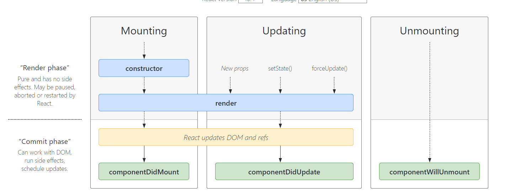

## 請列出 React 內建的所有 hook，並大概講解功能是什麼

### 1. useState：
 
`const [state, setState] = useState(初始值);`

回傳一個 `state` 的值，`setState` 是更新 `state` 的 `function`。可以根據需求自定義 `state` 的名稱。像是 Todo List 可以設定成：`const [todos, setTodos] = useState([])`。在還未 `setState` 前，得到的 `state` 值會是 `useState` 一開始設定的初始值，初始值也可以是 `function`。

### 2. useEffect：

`useEffect(didUpdate);`

告訴 React 在 DOM 有更動後呼叫在 `useEffect` 中的 `function`。  
如果沒有加第二個參數，則 `useEffect` 會在每次有更動時都執行。如果第二個參數為 `[]`，則是僅在第一次 render 畫面時執行。想要依據特定的 `state` 的變動而呼叫 `useEffect` 時，就將特定的 `state` 放在第二個參數中，例如： `[todos]`。

  * useEffect cleanup：（[參考程式碼來源](https://zh-hant.reactjs.org/docs/hooks-reference.html)）
    ```
    useEffect(() => {
      const subscription = props.source.subscribe();
      return () => {
        // Clean up the subscription
        subscription.unsubscribe();
      };
    });
    ```
清除 function 會在 component 從 UI 被移除前執行，來防止 memory leak。

### 3. useContext：

`const value = useContext(MyContext);`

`state` 的值只能在擁有 `state` 的 `component` 中改變，如果今天想要按 `button` 去改變 `state`，但這個 `button` 其實被層層包在各種 `function component` 下面，要在 `button` 取得 `count` 和 `setCount` 就要將這兩個的值一路從最上層經過 `FirstWrapper`、`SecondeWrapper` 傳到 `Button`：

```
function Button({ setCount, count }) {
  return <button onClick={() => setCount(count + 1)}>+</button>;
}

function SecondWrapper({ setCount, count }) {
  return (
    <div>
      <Button setCount={setCount} count={count} />
    </div>
  );
}

function FirstWrapper({ setCount, count }) {
  return (
    <div>
      <SecondWrapper setCount={setCount} count={count} />
    </div>
  );
}

function App() {
  const [count, setCount] = useState(0);

  return (
    <div className="wrapper">
      {count}
      <FirstWrapper setCount={setCount} count={count}></FirstWrapper>
    </div>
  );
}
```
而 `useContext` 就是將 `state` 的值用 `Provider` 傳下去，省下每一個子 `function component` 都要慢慢的傳。`import { createContext, useContext } from 'react'` 後，就可以利用 `const CountContext = createContext(null);` 將需要傳下去的值跟著 `CountContext.Provider` 的 `value` 一起傳下去。到 `Button` 的後再以 `const { count, setCount } = useContext(CountContext);` 將值接收後使用：

```
import { useState, createContext, useContext } from "react";

function Button() {
  const { count, setCount } = useContext(CountContext);
  return <button onClick={() => setCount(count + 1)}>+</button>;
}

function SecondWrapper() {
  return (
    <div>
      <Button />
    </div>
  );
}

function FirstWrapper() {
  return (
    <div>
      <SecondWrapper />
    </div>
  );
}

const CountContext = createContext(null);

function App() {
  const [count, setCount] = useState(0);

  return (
    <CountContext.Provider value={{ count, setCount }}>
      <div className="wrapper">
        {count}
        <FirstWrapper></FirstWrapper>
      </div>
    </CountContext.Provider>
  );
}
```

### 4. useReducer：

`const [state, dispatch] = useReducer(reducer, initialArg, init);`

使用時機，根據官方文件：

> 需要複雜的 state 邏輯而且包括多個子數值或下一個 state 依賴之前的 state，useReducer 會比 useState 更適用。


### 5. useCallback：

```
const memoizedCallback = useCallback(
  () => {
    doSomething(a, b);
  },
  [a, b],
);
```

和 `useMemo` 都是用來提高效能。與 `useMemo` 在 dependencies 改變後拿到的是呼叫 function 後的值不同，`useCallback` 拿到的是其回傳的 function。

```
function Button() {
  const handleClick = () => {
    console.log('Clicked!');
  };

  return // ...
}
```
在每次的渲染的 `Button` 中的 `handleClick` 都是不一樣的（因為放置 function 的記憶體位置不同），而利用 `useCallback` 將 `handleClick` 包起來，可以在重新渲染時，`handleClick` 是相同的。
```
function Button() {
  const handleClick = useCallback(() => {
    console.log('Clicked!');
  }, []);

  return // ...
}
```

### 6. useMemo：

`const memoizedValue = useMemo(() => computeExpensiveValue(a, b), [a, b]);`

 透過 `useMemo` 讓 React 記住 function 的回傳值，避免繁重的計算影響效能。

### 7. useRef：

`const refContainer = useRef(initialValue);`

accessing DOM nodes/elements and storing mutable information
可以抓取到 DOM 節點（nodes/ element）並存取可變動的資訊（像是 `input` 裡的值）

```
// 記得 import { useRef } from 'react'
function TextInputWithFocusButton() {
  // 建立物件實體，括號內為初始值 null
  const inputEl = useRef(null);
  const onButtonClick = () => {
    // `current` points to the mounted text input element
    // 將 input 與 useRef() 掛勾後，React 都會將其 .current 屬性設為相應的 DOM 節點（在此例 inputEl.current 是 <input type="text" />），便可操作相對應的節點
    inputEl.current.focus();
  };
  return (
    <>
      // 將 useRef 建立的物件利用 ref attribute 與 input 做掛勾
      <input ref={inputEl} type="text" />
      <button onClick={onButtonClick}>Focus the input</button>
    </>
  );
}
```

註：即使改變 `.current` 裡的值也不會 re-render。可以應用在當完成渲染頁面時 focus 在 `input` 上。

### 8. useImperativeHandle：

`useImperativeHandle(ref, createHandle, [deps])`

### 9. useLayoutEffect：

`useLayoutEffect(() => { // do something }, [array, dependency])`

和 `useEffect` 相似，兩者最主要的差異在於什麼時候被觸發。 `useLayoutEffect` 會在所有的 DOM 變更後，「同步」調用。`useEffect` 則是在畫面渲染完後才會執行，以避免阻塞（block）瀏覽器渲染畫面。

### 10. useDebugValue：

`useDebugValue(value)`

在 React DevTools 中顯示自訂義 hook 的標籤。


**參考：**

1. [memoized](https://en.wikipedia.org/wiki/Memoization)
2. [【Day 24】 useRef](https://ithelp.ithome.com.tw/articles/10221937)
3. [useEffect vs. useLayoutEffect in plain, approachable language](https://blog.logrocket.com/useeffect-vs-uselayouteffect/)（顯淺易懂QQ）
4. [Hooks API 參考](https://zh-hant.reactjs.org/docs/hooks-reference.html)
5. [React 性能優化那件大事，使用 memo、useCallback、useMemo](https://medium.com/%E6%89%8B%E5%AF%AB%E7%AD%86%E8%A8%98/react-optimize-performance-using-memo-usecallback-usememo-a76b6b272df3)
6. [Your Guide to React.useCallback()](https://dmitripavlutin.com/dont-overuse-react-usecallback/)

---

## 請列出 class component 的所有 lifecycle 的 method，並大概解釋觸發的時機點


擷取自 [React 官方提供 lifecycles 表](https://projects.wojtekmaj.pl/react-lifecycle-methods-diagram/)

### **1. constructor**

被 mount 之前被呼叫，可在此設置 this.state 的初始值，及被綁定的 function。

### **2. render**

在資料變動的時會被呼叫，負責渲染頁面。是 class component 唯一一個必須呼叫的的 function（但若 ` shouldComponentUpdate()` 回傳的是 `false` 時則不會被呼叫）。

### **3. componentDidMount**

在一個 component 被 mount 後，componentDidMount() 會馬上被呼叫。可在此設置網路請求（拿 API）

### **4. componentDidUpdate**

會在資料和 DOM 更新後馬上被呼叫。可比較更新後的 state 和之前有無差別，並重新設置 `setState`。與 `render` 相同，若 ` shouldComponentUpdate()` 回傳的是 `false` 時則不會被呼叫。

### **5. componentWillUnmount**

 會在ㄧ個 component 被 unmount 和 destroy 後馬上被呼叫。可以在此設置清理一些之前設置的 function。被 unmount 後的 component 不會再被 mount，所以在此 `setState` 並沒有用。


註：
mount 指 component 被加入 DOM tree 時。


---

## 請問 class component 與 function component 的差別是什麼？

### **class component：**

以 ES6 的 class 為基礎去撰寫的 component，並且要加上 `extends React.Component`，才能繼承到 `React.Component`。內部利用 `render()` method 回傳 HTML。  
`constructor()` function，會在 component 被建立時被呼叫，可以在裡面設置一些初始化設定，例如 `state` 等。


```
class Welcome extends React.Component {
  constructor() {
    super();
    this.state = {name: "hehe"};
  }

  render() {
    return <h1>Hello, {this.state.name}</h1>;
  }
}
```

### **function component：**

利用 JavaScript function 建立的 component，最後也會回傳 HTML。  
引入 `useState` 去設置 `state`。

```
function Welcome(props) {
  const [state, setState] = useState('hehe');

  return <h1>Hello, {state.name}</h1>;
}
```

另外因為 class component 是以當下 this 為依據，儘管 props/ state 是從上層傳下來不會變的東西，但 this 會。所以在送出資料後，如果還有修改資料，拿到的會是最新的資料，而非按下送出時的資料。參考〈[How Are Function Components Different from Classes?](https://overreacted.io/how-are-function-components-different-from-classes/)〉中的範例改了/ 自己測試一下超陽春版：

```
class App extends React.Component {
  constructor() {
    super();
    this.state = { user: "" };
  }

  showMessage = () => {
    alert(this.state.user);
  };

  handleClick = () => {
    const { user } = this.state;
    setTimeout(() => this.showMessage(user), 3000);
  };

  render() {
    return (
      <div>
        <input
          value={this.state.user}
          onChange={(e) => this.setState({ user: e.target.value })}
        />
        <button onClick={this.handleClick}>送出</button>
        <h1>Hello, {this.state.user}</h1>
      </div>
    );
  }
}
```
在輸入 tes 時送出：

在按下送出後多打一個 t，之後跳出的視窗會是 test，而非當時的 tes。

（不會 gif 只好用截圖...）

以下是以 function component 改寫：

```
function App() {
  const [user, setUser] = useState("");

  const showMessage = () => {
    alert(user);
  };

  const handleClick = () => {
    setTimeout(() => showMessage(user), 3000);
  };

  return (
    <div>
      <input value={user} onChange={(e) => setUser(e.target.value)} />
      <button onClick={handleClick}>送出</button>
      <h1>Hello, {user}</h1>
    </div>
  );
}
```

在輸入 tes 時送出：

在按下送出後多打一個 t，之後跳出的視窗依舊顯示是 tes，而非最新的 test。


當再次改變 `input` 的輸入值時，雖然 `user` 的值有變動，但因為送出的按鈕是隸屬於前次 function，所以拿到的值也是前次的（tes）。如果想在 function component 中拿到最新的值，就需要搭配 `useRef` 一起使用。


**參考：**

1. [Components 與 Props](https://zh-hant.reactjs.org/docs/components-and-props.html)
2. [w3schools React Components](https://www.w3schools.com/react/react_components.asp)
3. [How Are Function Components Different from Classes?](https://overreacted.io/how-are-function-components-different-from-classes/)
4. [從實際案例看 class 與 function component 的差異](https://blog.techbridge.cc/2020/06/13/class-function-component-and-useeffect/)

---

## uncontrolled 跟 controlled component 差在哪邊？要用的時候通常都是如何使用？

uncontrolled 和 controlled component 主要是看是不是以 react 去控制。uncontrolled component 裡的資料是 DOM 自己處理的，如果要拿資料也是從 DOM 裡去撈。

```
function App() {
  return (
    <div className="wrapper">
      <form>
        username：
        <input />
      </form>
    </div>
  );
}
```

但我們通常都會希望資料可以儲存在 React 的 state 中，將 `input` 的 `value` 和 state 綁定，並透過 `onChange` 去監聽 `input` 的值有沒有改變再 `setValue`。

```
function App() {
  const [value, setValue] = useState("");

  return (
    <div className="wrapper">
      <form>
        username：
        <input value={value} onChange={(e) => setValue(e.target.value)} />
      </form>
    </div>
  );
}
```

如果沒有 `onChange` 去 `setValue` 改變 `state` 的話，則畫面上 `input` 的值就會是 `value` 的初始值，並且怎麼輸入 `input` 都沒有用，還是會維持在初始值，因為其 `value` 已經是由 React 所控制的。

```
function App() {
  const [value, setValue] = useState("init");

  return (
    <div className="wrapper">
      <form>
        username：
        <input value={value} />
      </form>
    </div>
  );
}
```


不管怎樣都是 init。